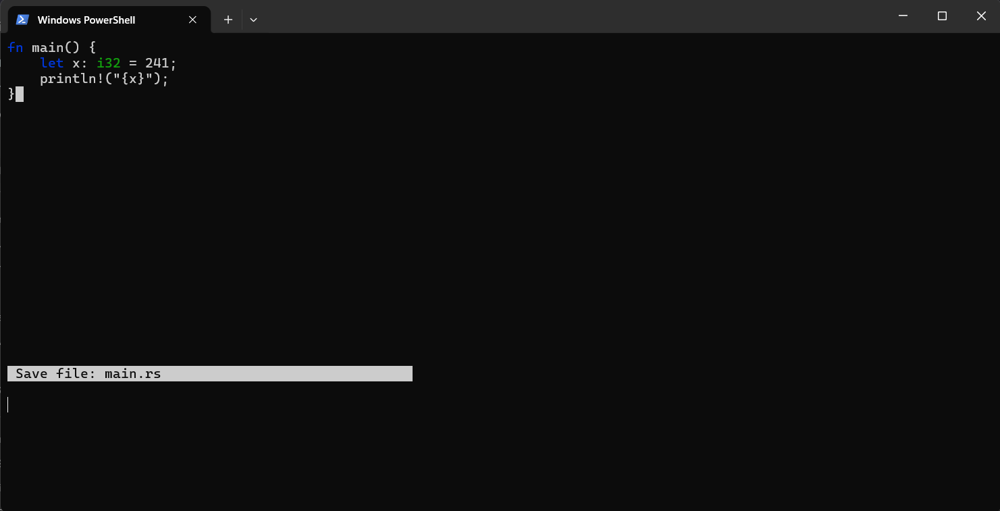

# Tidy

A lightweight Terminal User Interface (TUI) text editor written entirely in Rust.



> **Note**: Tidy currently supports **Windows** (`Windows PowerShell` / `cmd`). Cross-platform support for Linux and macOS is planned for future updates.

---

## Features

- **Built with Rust**: Fast, efficient, and lightweight memory footprint.
- **Syntax Highlighting**: Supports basic syntax coloring for types, keywords, and functions.
- **Interactive Prompts**: Simple bottom status bar for saving and editing files.
- **Minimalist Interface**: No clutter—focus on your code directly in your PowerShell terminal.

---

## Getting Started

### Prerequisites

- Windows OS
- [Rust & Cargo](https://rustup.rs/) installed

### Installation

Clone the repository and build it locally:

```powershell
git clone [https://github.com/enes73546/Tidy.git](https://github.com/enes73546/Tidy.git)
cd Tidy
cargo build --release

```
## Installation & Usage

### 1. Install via Cargo

Make sure you have [Rust](https://rustup.rs/) installed, then run:

```powershell
# Clone the repository
git clone [https://github.com/enes73546/Tidy.git](https://github.com/enes73546/Tidy.git)
cd Tidy

# Install the executable globally
cargo install --path .